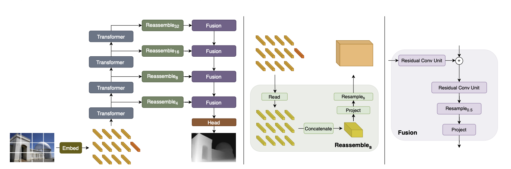

Dense Prediction Transformer (DPT) converts transformer patch tokens into a pixel level prediction.

The fundamental assumption is spatial correspondence:
$$
\text{output location }(i,j) \longleftrightarrow \text{input image region }(i,j)
$$

# Constructing Different Resolutions
For a $384\times384$ image with $16\times16$ patches, every selected ViT layer initially contains a $24\times24$ token grid.

It then applies learned resampling operations to four selected transformer layers:
$$
\begin{aligned}
24\times24&\rightarrow96\times96 && \text{transposed convolution, stride 4}\\
24\times24&\rightarrow48\times48 && \text{transposed convolution, stride 2}\\
24\times24&\rightarrow24\times24 && \text{no resampling}\\
24\times24&\rightarrow12\times12 && \text{convolution, stride 2}
\end{aligned}
$$

Earlier transformer layers are assigned higher resolutions because they preserve more local detail. Deeper layers are assigned lower resolutions because they contain more global information.

# Fusing the Feature Maps
A convolution first maps every feature map to the same channel count, normally 256. DPT then fuses them from coarse to fine:
$$
12\rightarrow24\rightarrow48\rightarrow96\rightarrow192
$$

At each stage, DPT:
1. Processes the same resolution skip feature with a Residual Convolutional Unit.
2. Adds it to the decoder feature.
3. Refines the sum with another RCU.
4. Upsamples the result by two.

Conceptually:
$$
P_i=\operatorname{Upsample}_2
\left(
\operatorname{RCU}
\left(
P_{i+1}+\operatorname{RCU}(F_i)
\right)
\right)
$$

For a $384\times384$ input, fusion produces a $192\times192$ representation. A task specific head converts it into depth or class predictions and upsamples it to the final output resolution.
