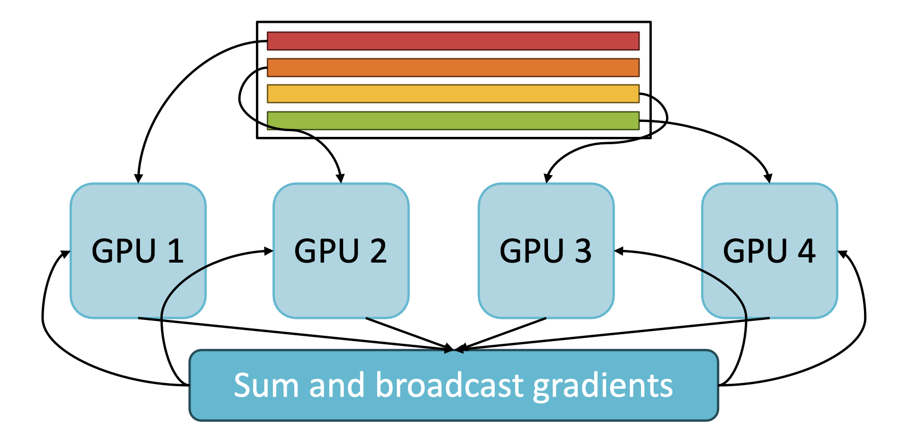
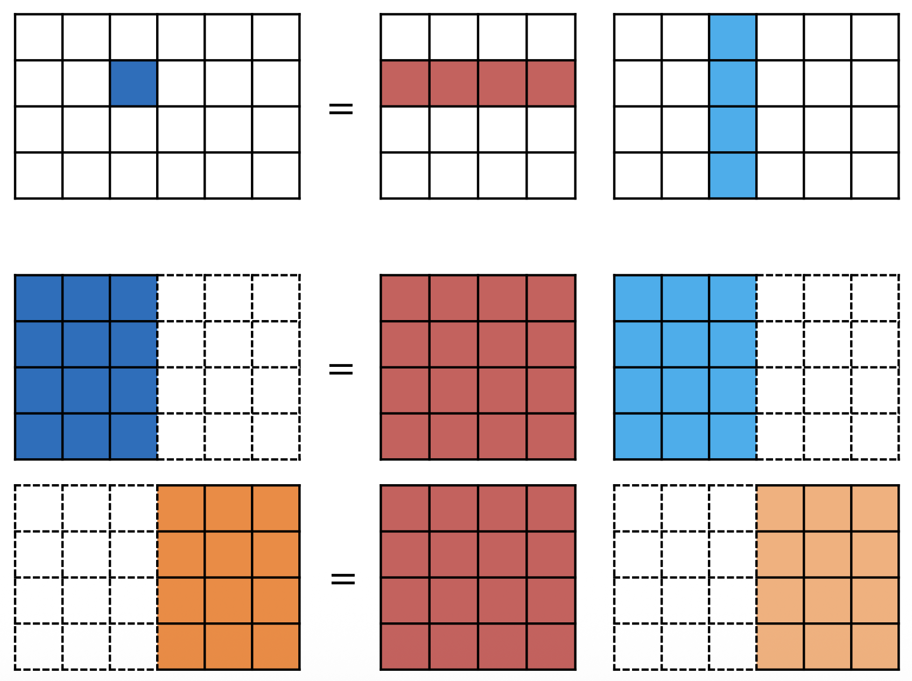
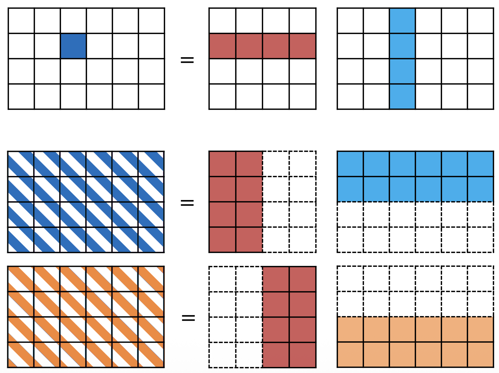
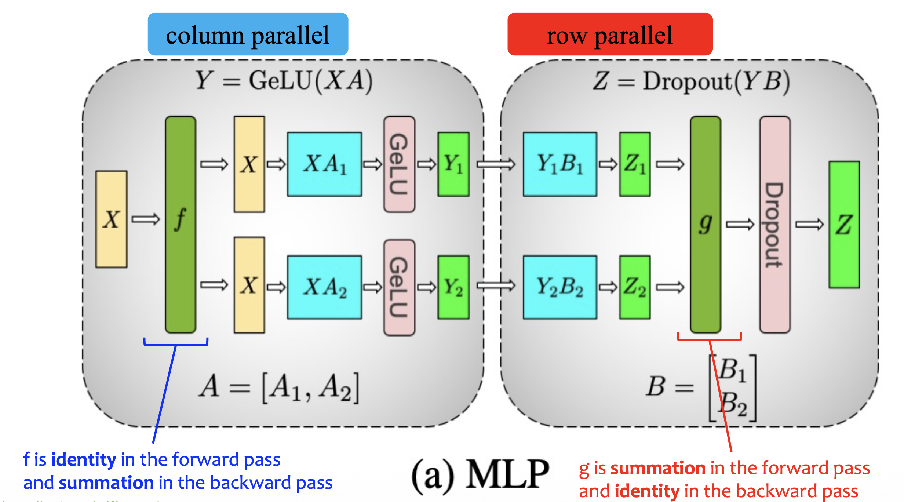
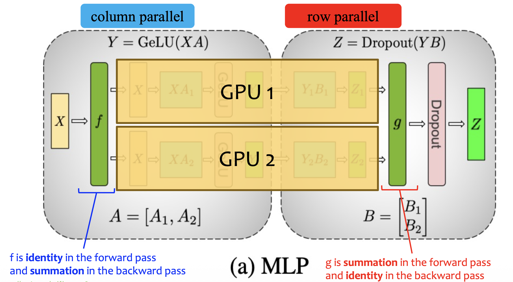
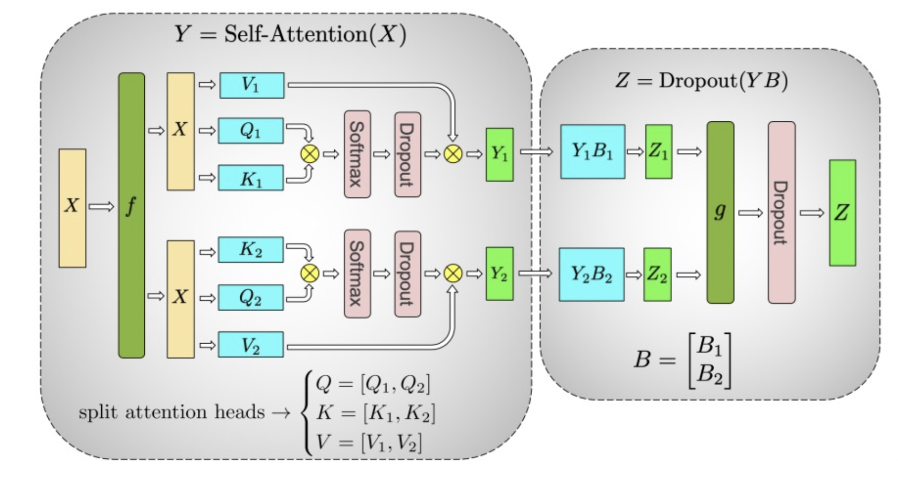
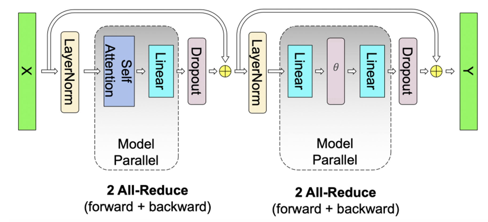
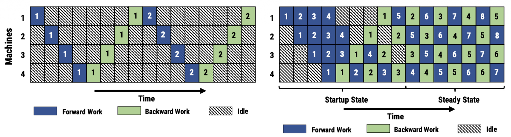
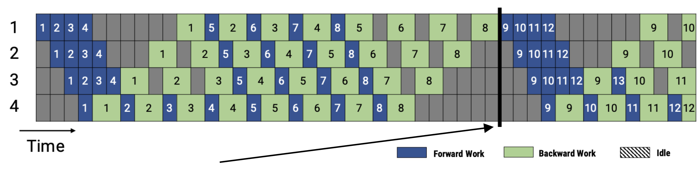
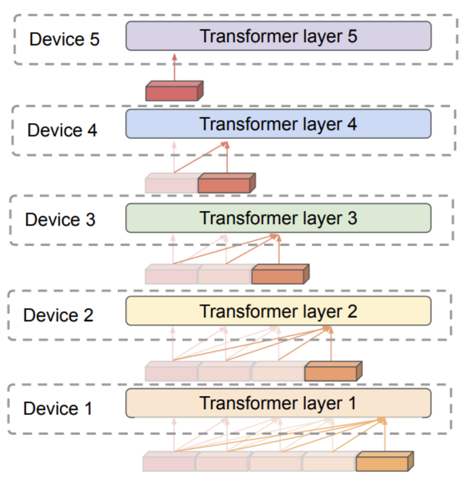

Goal: Divide the work of training an LLM across multiple GPUs such that **inter-GPU communication is minimized**.

Methods:
- Data parallelism.
- Tensor parallelism.
- Pipeline parallelism.

# Data Parallelism
Split each batch of data evenly across multiple GPUs and have each GPU compute the forward and backward pass for its data.

# Tensor Parallelism
Tensor parallelism splits one large layer (e.g. transformer layer with large hidden dimensions) across multiple GPUs
- Larger model capacity: partition large layers.
- Faster computation: multiple devices jointly execute each large matrix multiplication.
## Parallel Matrix Multiplication/Linear Blocks
**Stand matrix multiplication.**
$$
Z = XW
$$

**Column parallel matrix multiplication.**  
$$
Z_A = X W_A
$$
$$
Z_B = X W_B
$$
$$
Z = [Z_A, Z_B]
$$

**Row parallel matrix multiplication.**  
$$
Z_A = X_L W_A
$$
$$
Z_B = X_R W_B
$$
$$
Z = Z_A + Z_B
$$

**Note that by "column" and "row" parallel, we refer to how the weight matrix $W$ is partitioned.**

Note that
- The backward pass of a column parallel matrix multiplication is a row parallel matrix multiplication.
- The backward pass of a row parallel matrix multiplication is a column parallel matrix multiplication.
## Parallel MLP Blocks
In a transformer, the MLP blocks usually consist of 2 linear layers. This is especially efficient  because **by alternating column and row parallel matrix multiplication, only 1 inter-GPU communication is required**.

**The output of the column parallel block is exactly the input of the row parallel block.**

This fits perfectly into multiple GPUs.

## Parallel Self-Attention Blocks
In a self-attention block:
- The multi-headed attention is trivially parallel.
- The linear layer is a row parallel matrix multiplication.

## Parallel Transformer Layers
A transformer layer consist of a self-attention block and a MLP block.

4 inter-GPU communications are required.

# Pipeline Parallelism
Pipeline parallelism splits layers across multiple GPUs. Each GPU computes one stage of the model, then sends its output to the next device.

To keep the GPUs busy, different GPUs should work on different **microbatches** concurrently.

This schedule is called one-forward-one-backward (1F1B) mechanism.

There are 2 ways to update the model weight in pipeline parallelism:
1. Synchronous schedules.
2. Asynchronous schedules.

**Synchronous schedules.**
In a synchronous schedule, weights are updated at the batch boundary.

The black line indicates a **pipeline flush** between minibatches. Weights are synced and updated at the pipeline flush.

**Asynchronous schedules.**  
In an asynchronous schedule, weights are updated while work remains in flight.

The weights used to compute the backward pass of a microbatch need to be the same weights used to compute the forward pass of that microbatch. Therefore, an asynchronous schedule needs to **stash the weights in RAM and reload them to VRAM for the corresponding backward pass**.

Dynamic programming can be used to partition the layers across GPUs based on the profile.
## Token-Based Pipeline Parallelism
Instead of waiting for the whole sequence to finish before giving it to the next layer, each GPU works on a chunk of tokens. 

After GPU1 finishes processing chunk1, it passes it to GPU2, and starts processing chunk1, while GPU2 starts processing chunk1.

# Optimizer Parallelism
Many advanced optimizers require storing additional state variables. Optimizer parallelism splits optimizer states across multiple GPUs.

# Expert Parallelism
Expert parallelism splits expert networks across multiple GPUs.
[MoE](MoE.md)

# Fully Sharded Data Parallel (FSDP)
Parameters, gradients, and optimizer states are sharded across GPUs. Each GPU owns only 1/N of each tensor. Before a forward or backward pass on a layer, GPUs do an all-gather to temporarily reconstruct the full layer, compute, then discard the gathered parameters.
