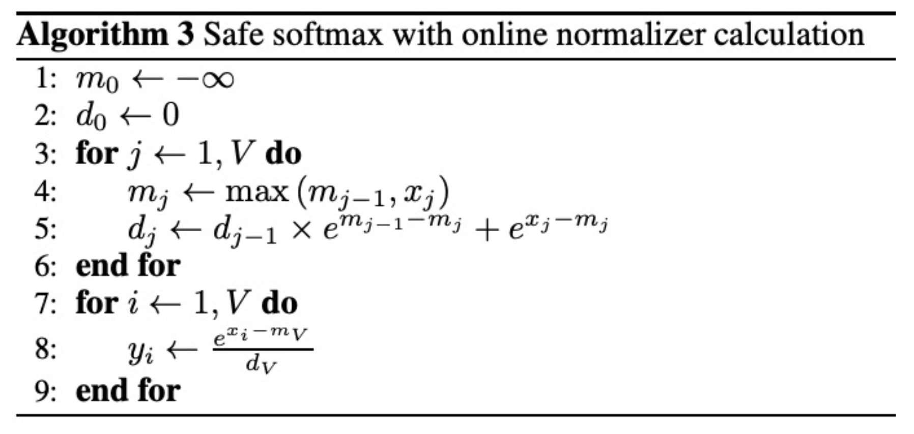
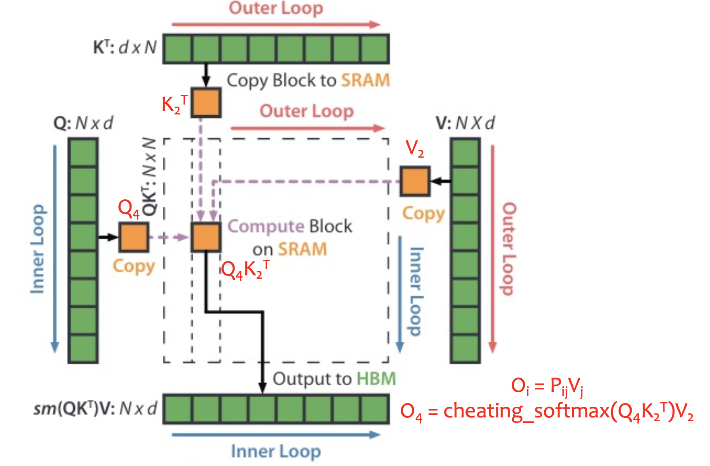

# Online Softmax
Safe softmax requires 3 iterations over the logits. Online softmax reduces it to 2 iterations.

Proof by induction:
$$d_j = \sum_{i=1}^j e^{x_i - m_j} \quad \forall j = 1, \dots, V $$

# Kernel Fusion
For a usual PyTorch neural network in eager mode, **each operation normally launches a separate GPU kernel**. **The output of each kernel is written back from SRAM to HBM for the next kernel to read.**

Fusing these kernels can reduce the data transfer.

# Flash Attention
In a transformer, a lot of time is wasted moving data around on the GPU instead of doing computation.

Flash attention reduces data transfer, and increase reuse of data in SRAM. This is similar to [Hardware Acceleration](../Machine%20Learning/Hardware%20Acceleration.md) 

Flash attention combines several ideas:
- Tiling: computes attention weights block by block to reuse data in SRAM.
- Kernel fusion: fuses matmul and softmax on SRAM.
- Online softmax: enables kernel fusion while tiling.

$O_i$ stores the running local output that correspond to $Q_i$.

The outer loop updates all of these running local outputs using 1 chunk of $K$ and $V$, while the inner loop updates each one of these running local outputs.