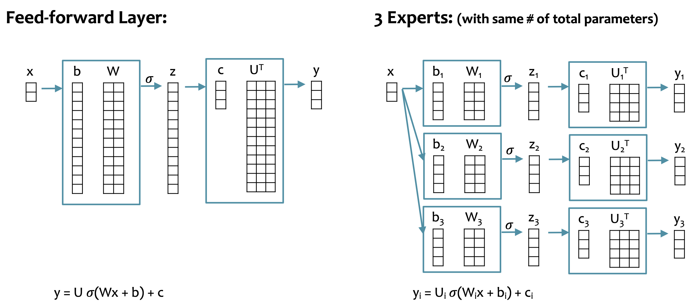
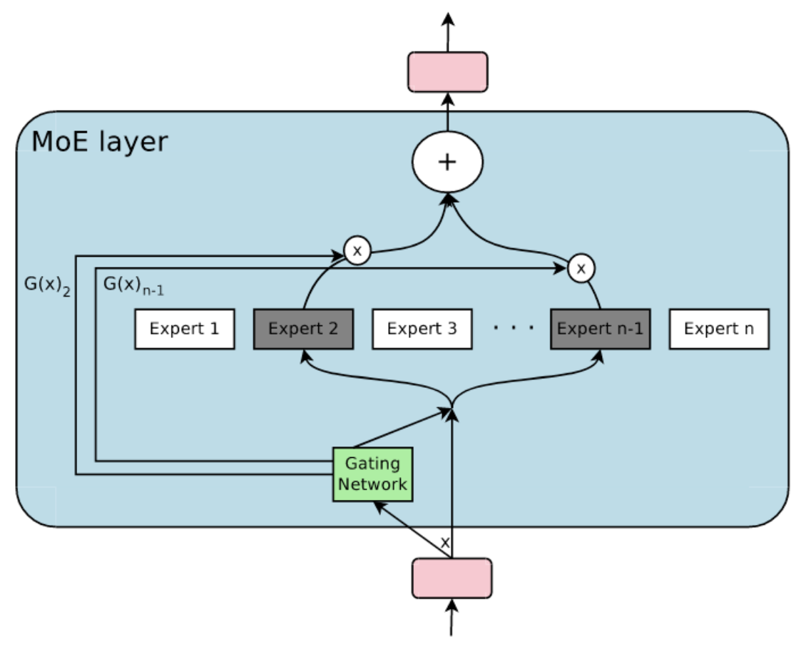
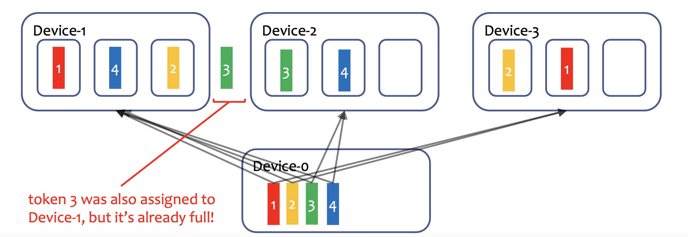

In a transformer, FFNs have more parameters than attention blocks. MoE reduces the number of active parameters by breaking the FFN into several experts, activating only some of these experts, and ensembling their results.

MoE:
- Performs better than a model with the same number of active parameters.
- Converges faster than a model with the same number of total parameters.

# Breaking FFN into Experts
The feed-forward network inside the transformer layer can be broken into several **experts**, by breaking the weights by row in the first layer, and by column in the second layer. [Distributed Training#Tensor Parallelism](Distributed%20Training.md#Tensor%20Parallelism)

# Dense MoE
A dense MoE gives every expert a (non-zero) voice in the output.
$$
\mathbf y = \sum_{i=1}^{N_e} G(\mathbf x)_i E_i(\mathbf x)
$$
where
$$
G(\mathbf x) = \mathrm{softmax}(\mathbf x \mathbf W_g + \mathbf b_g)
$$
is the voice of each expert, and $E_i(x)$ is the output of expert i.

**Note that this is no longer equivalent to the original FFN because the routing weight changes with respect to the input.**

# Sparsely Gated MoE

A sparsely gated MoE routes tokens to the top k experts.
$$
\mathbf y = \sum_{i=1}^{N_e} G(\mathbf x)_i E_i(\mathbf x)
$$
where
$$G(\mathbf x) = \mathrm{softmax}(\mathrm{topk}(\mathbf x \mathbf W_g + \mathbf b_g + \mathbf r_\text{noise}(\mathbf x), k))$$
$$
\mathbf r_\text{noise}(\mathbf x) = N(\mathbf 0, \mathbf I) \cdot \text{sigma}(\mathbf x \mathbf W_\text{noise} + \mathbf b_\text{noise})
$$

We initialize $\mathbf W_g$ and $\mathbf W_\text{noise}$ to all zeros, such that when the training starts, the experts are chosen randomly.

# Expert Parallelism
- Each expert is allocated to a different GPU.
- Each token is routed to K experts.
- Each GPU can only handle P tokens.

We need to balance the load of each GPU. This can be achieved by **adding regularizers during training to encourage the router to produce balanced load over the experts**.