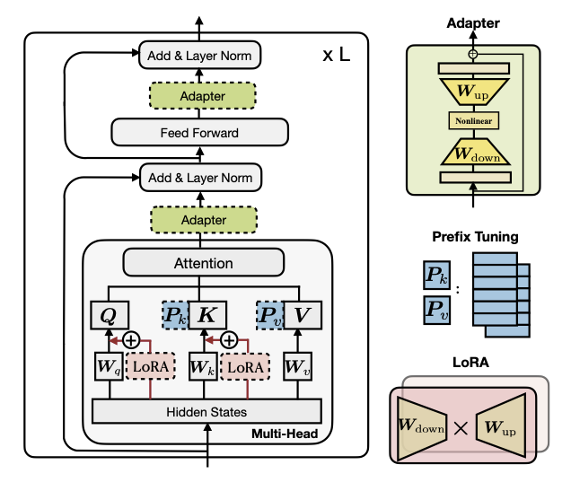
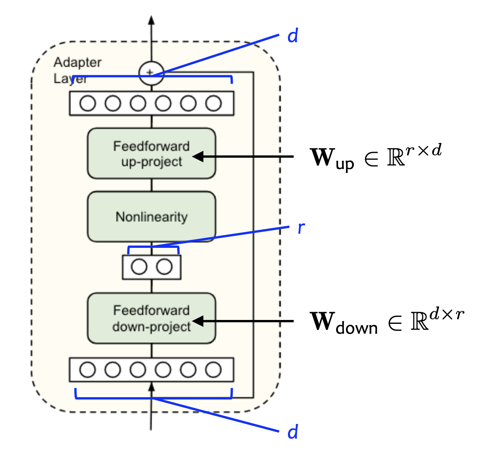
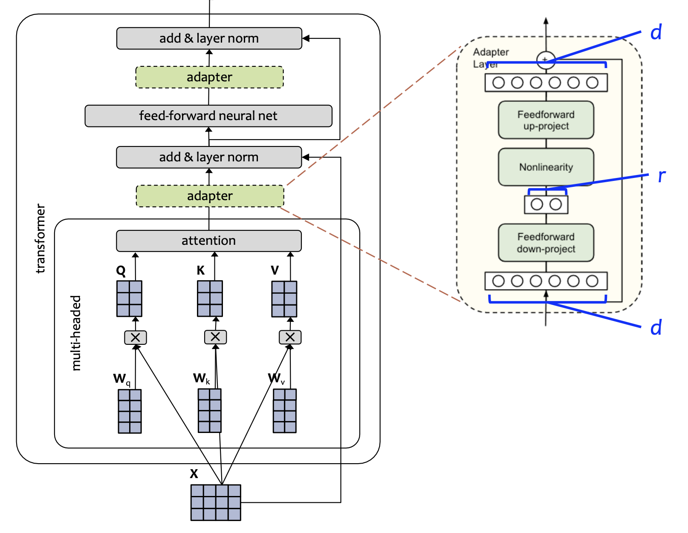
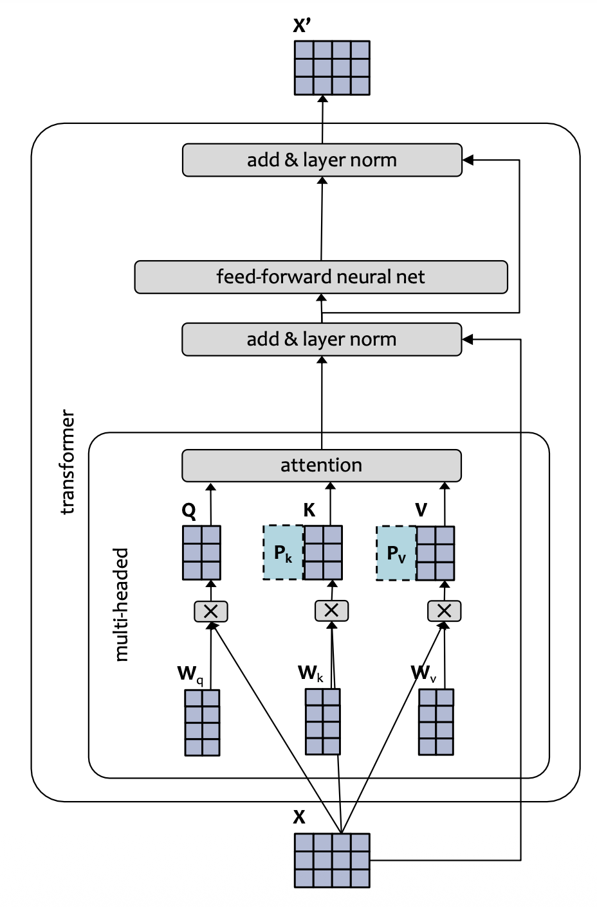
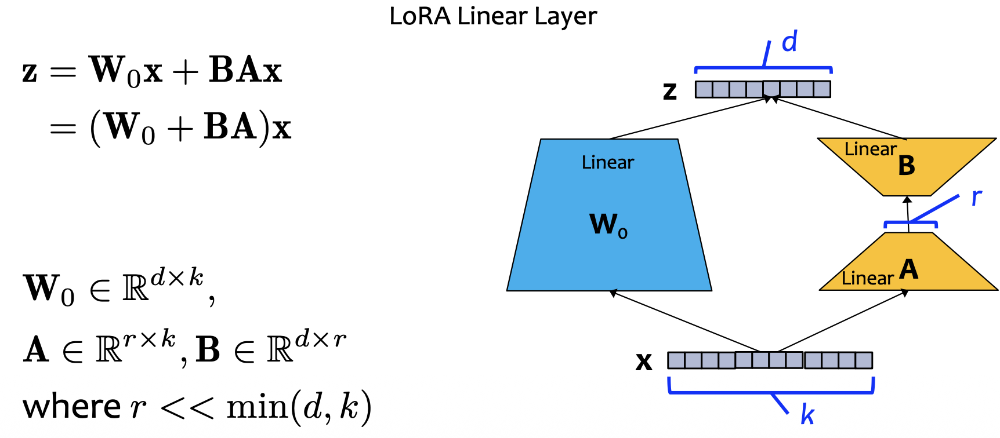

Goal: Fine-tune fewer parameters, but achieve comparable performance to fine-tuning all parameters.

# Subset
Pick a subset of the parameters and tune only this subset of parameters (e.g. only the top K layers).

# Adapters
Add additional layers that have few parameters and tune only these additional layers.

# Prefix Tuning
Pretend there exist many prefix tokens before the actual sequence and tune only the keys and values of these tokens.

# Intrinsic Dimensionality
Learn a neural network with D parameters in a random lower dimensional subspace, d. Let the **intrinsic dimension** be the value of d when good solutions start to appear.

To train in a smaller subspace $\mathbb R^d$, define $\theta^{(D)}$:
$$
\theta^{(D)} = \theta_0^{(D)} + P \theta^{(d)}
$$
where $\theta_0^{(D)}$ and $P$ are randomly generated and **frozen**, and $\theta^{(d)}$ is a parameter vector in the smaller subspace $\mathbb R^d$. 

Why don't LLMs overfit?
- They are intrinsically low dimensional.
- **Gradient descent often prefers a smooth solution.**

# LoRA
Add a low-rank delta to each parameter matrix and tune only this delta. 

Motivations:
- Linear layers are large.
- Large models reside on a low intrinsic dimension.
- Adapters introduce inference latency that is non-trivial.

Initialization:
$$
\mathbf A \sim \mathcal N (0, \sigma^2)
$$
$$
\mathbf B = 0
$$
This ensures that, at the start of fine-tuning, the parameters hold their pre-trained values.

At inference time, replace original weight with new weight:
$$
W \leftarrow W_0 + BA
$$

You can also fine-tune the bias, but bias already has rank 1, so it is not relevant to LoRA.

# Computation
There are three ways in which we expect the computation time to change during training:
1. We expect slowdown from additional computation.
2. We expect speedup from fewer gradient computations.
3. We expect speedup from being able to use a larger batch size because we use so much less GPU memory.

Which of these slowdown/speedup changes wins out is non-trivial and depend on the hyperparameters.