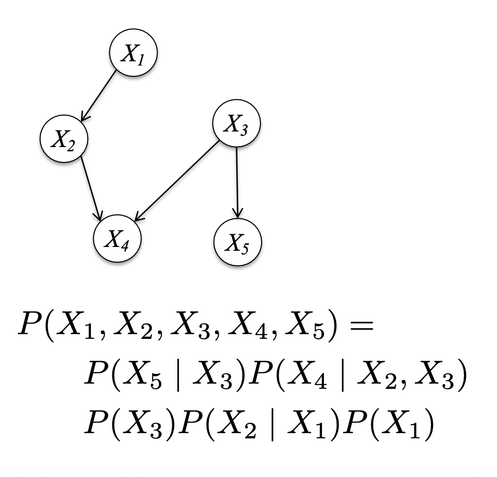
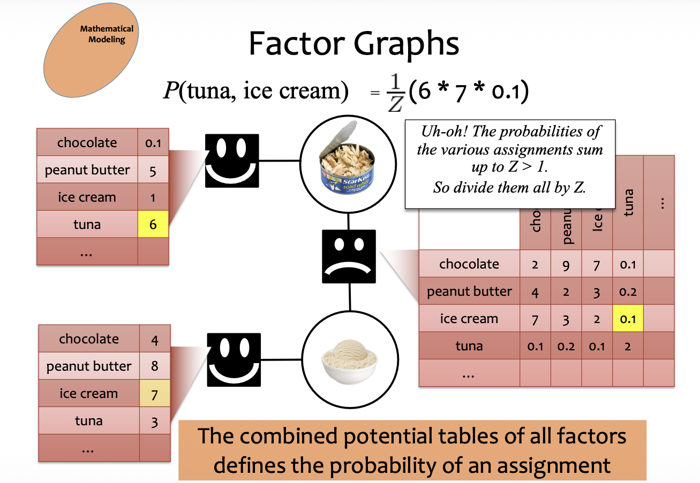

# Directed Graphical Model
$$
P(X_1, \dots, X_T) = \prod_{t=1}^T P(X_t | \text{parents}(X_t))
$$

# Undirected Graphical Models

# Factor Graphs
Factor Graphs
• Variables (circles)
• Factors (squares)

Each **random variable** can be assigned a **value**.

The collection of values for all the random variables is called an **assignment**.

Factors have local opinions about the assignments of their neighboring variables. These opinions are expressed through **potential tables**.

