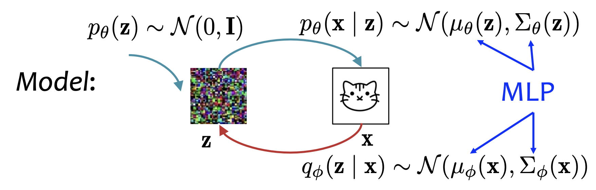

Variational auto encoder (VAE) is a latent variable model. 
$$
p_\theta (\mathbf x | \mathbf z) \sim \mathcal N (\mu_\theta(\mathbf z), \Sigma_\theta(\mathbf z))
$$

**To maximize $p_\theta(\mathbf x)$, VAE introduces another learned distribution $q_\phi(\mathbf z | \mathbf x)$ to form a tight lower bound of $\log p_\theta(\mathbf x)$, called ELBO, and maximizes ELBO.**

Encoder: 
The encoder predicts the distribution of the latent variable $\mathbf z$ given the image $\mathbf x$.
$$
q_\phi(\mathbf z | \mathbf x) \sim \mathcal N (\mu_\phi(\mathbf x), \Sigma_\phi(\mathbf x))
$$

Decoder: 
The decoder predicts the distribution of the image $\mathbf x$ given the latent variable $\mathbf z$.
$$
p_\theta(\mathbf z) \sim \mathcal N(\mathbf 0, \mathbf I)
$$
$$
p_\theta (\mathbf x | \mathbf z) \sim \mathcal N (\mu_\theta(\mathbf z), \Sigma_\theta(\mathbf z))
$$

# ELBO
For a probabilistic model $p_\theta(x, z)$, and **any** variational distribution $q_\phi(z | x)$, evidence lower bound (ELBO) is:
$$
\mathrm{ELBO}(x; \theta, \phi) = \mathbb E_{q_\phi(z|x)} \left[ \log \frac{p_\theta(x, z)}{q_\phi(z | x)} \right]
$$

Note that:
$$
\log p_\theta(x) = \mathrm{ELBO}(x; \theta, \phi) + D_\mathrm{KL}(q_\phi(z|x) || p_\theta(z|x))
$$

Because KL divergence is non-negative,
$$
\log p_\theta(x) \geq \mathrm{ELBO}(x; \theta, \phi)
$$

**ELBO is a lower bound of $\log p_\theta(x)$.**

By optimizing $\theta$ to increase ELBO, we increase the lower bound of $\log p_\theta (x)$. Therefore, we use ELBO as a **surrogate** for $\log p_\theta(x)$. 

However, this does not guarantee that $\log p_\theta(x)$ also increases. Because $D_\mathrm{KL}(q_\phi(z|x) || p_\theta(z|x))$ may grow.

**For ELBO to be a better surrogate for $\log p_\theta(x)$, we should minimize $D_\mathrm{KL}(q_\phi(z|x) || p_\theta(z|x))$.**

VAE picks $q_\phi(z|x)$ to be a Gaussian. 

# Variational Inference
Goal: Estimate an intractable distribution $p_\theta(z|x)$ with a tractable distribution $q_\phi(z|x)$.

Optimization problem:
$$
\phi^* = \arg\min_\phi D_\mathrm{KL}(q_\phi(z|x)||p_\theta(z|x))
$$

However, the KL divergence is intractable, because it involves the intractable distribution $p_\theta(z|x)$.

**Variational inference minimizes KL divergence by maximizing ELBO.**
$$
\begin{aligned}
\phi^* & = \arg\min_\phi D_\mathrm{KL}(q_\phi(z|x)||p_\theta(z|x))\\
& = \arg\min_\phi \log p_\theta(x) - \mathrm{ELBO}(x; \theta, \phi)\\
& = \arg\max_\phi \mathrm{ELBO}(x; \theta, \phi)
\end{aligned}
$$

# VAE
Intuitively, we should alternately:
1. Maximize $\phi$ to match $q_\phi(z|x)$ to the current $p_\theta$ as close as possible (variational inference).
2. Then maximize $\theta$ to push up the likelihood $\log p_\theta(x)$ as much as possible (learning).

But this is slow. **VAE instead use SGA and maximize $\theta$ and $\phi$ simultaneously:**
$$
(\theta, \phi) \leftarrow (\theta, \phi) + \gamma \nabla_{\theta, \phi} \mathrm{ELBO}(x; \theta, \phi)
$$

For a training sample $x$:
$$
\begin{aligned}
\mathrm{ELBO}(x; \theta, \phi) & = \mathbb E_{q_\phi(z|x)} \left[ \log \frac{p_\theta (x, z)}{q_\phi(z|x)} \right]\\
& = \mathbb E_{q_\phi(z|x)} \left[ \log \frac{p_\theta(x|z)p_\theta(z)}{q_\phi(z|x)} \right]\\
& = \mathbb E_{q_\phi(z|x)} [\log p_\theta(x|z)] + D_\mathrm{KL}(q_\phi(z|x)||p_\theta(z))
\end{aligned}
$$

The second part of ELBO is tractable, but the first part is not. VAE use [Monte Carlo Estimation](../Math/Monte%20Carlo%20Estimation.md) to estimate the first part:
$$
\mathbb E_{q_\phi(z|x)} [\log p_\theta(x|z)] \approx \frac{1}{S} \sum_{s=1}^S \log p_\theta(x | z^{(s)})
$$

VAE picks $S = 1$.