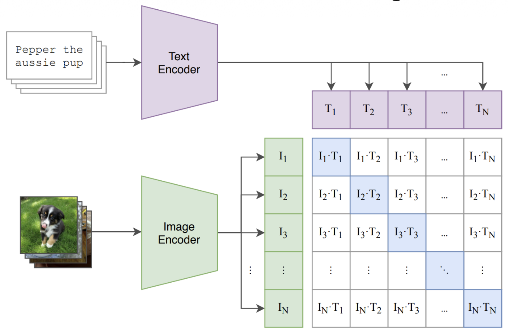
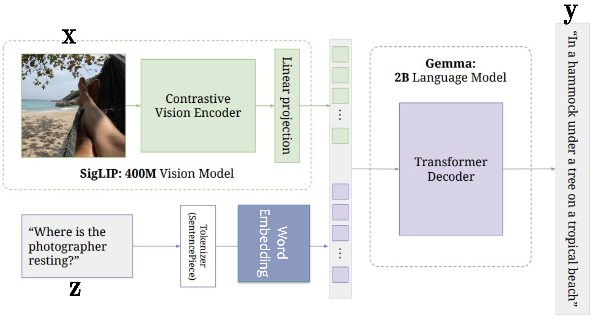
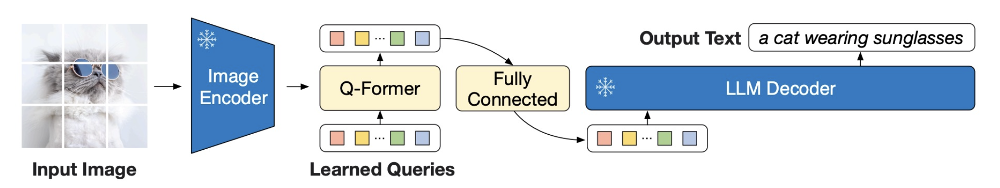
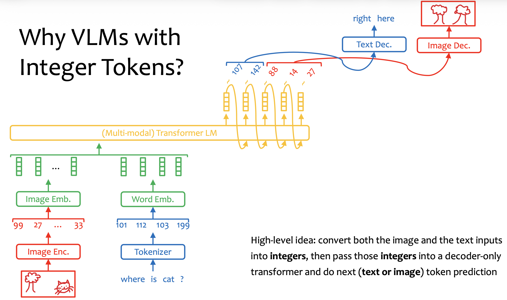

# CLIP
CLIP trains the text encoder and image encoder jointly in a contrastive matter.

CLIP's objective function:
$$
\max \sum_{i=1}^N \left[ \log \frac{\exp\left(\frac{I_i^T T_i}{\tau}\right)}{\sum_{j=1^N} \exp\left(\frac{I_i^T T_j}{\tau}\right)} + \log \frac{\exp\left(\frac{I_i^T T_i}{\tau}\right)}{\sum_{j=1^N} \exp\left(\frac{I_j^T T_i}{\tau}\right)} \right]
$$

# SigLIP
Large batch size is helpful, but the original CLIP objective function requires softmax over the whole batch size.

SigLIP's objective function:
$$
\max \sum_{i=1}^N \sum_{i=j}^N \log \frac{1}{1 + \exp(y_{ij}(-w I_i^T T_j + b))}
$$
where
$$
y_{ij}= \begin{cases} 
1, &i=j\\ 
-1, &i\ne j
\end{cases}
$$

# PaliGemma
Apart from the SigLIP vision encoder and the Gemma LM, PaliGemma trains a linear projection to create image embeddings that live in the word embedding space.

# Querying Transformer
Querying transformer builds an efficient bridge between a language model and a vision model.

It extracts information from the image using a set of learned query tokens.

# VLM with Text and Image Decoders
With an image tokenizer and image decoder such as [VQ-VAE](VQ-VAE.md), the VLM can generate both text and image.

Joint text and image generation is still uncommon. Most VLMs accept multiple input modalities, such as text and images, but generate only text.