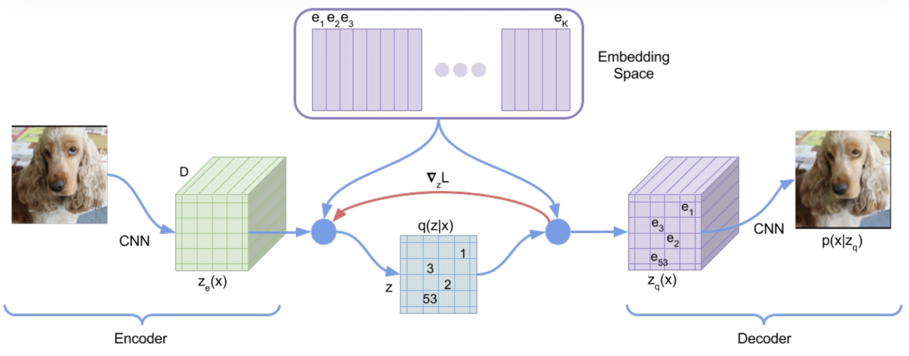

Vector-Quantized VAE.

The quantized latent vector:
$$
z_g(x) = {\arg\min}_{e \in \{e_1, \dots, e_k\}} || z_e(x) - e||_2^2
$$

$\arg\min$ is not differentiable.

The **straight-through estimator**
$$
\frac{\partial l}{\partial z_e(x)} \approx \frac{\partial l}{\partial z_q(x)}
$$
treats the gradient w.r.t $z_q(x)$ as an estimate of the gradient w.r.t. $z_e(x)$.

VQ-VAE also augments the VAE objective function with some regularizing terms that drive the encoder output and quantized latent closer to each other.
$$
- \log p_\theta(x|z_q(x)) + ||\text{sg}[z_e(x) - z_q(x)]||_2^2 + \beta ||z_e(x) - \text{sg}[z_q(x)]||
$$
where $\text{sg}$ is the stop-gradient operator which fixes its argument to be non-updated constant.

