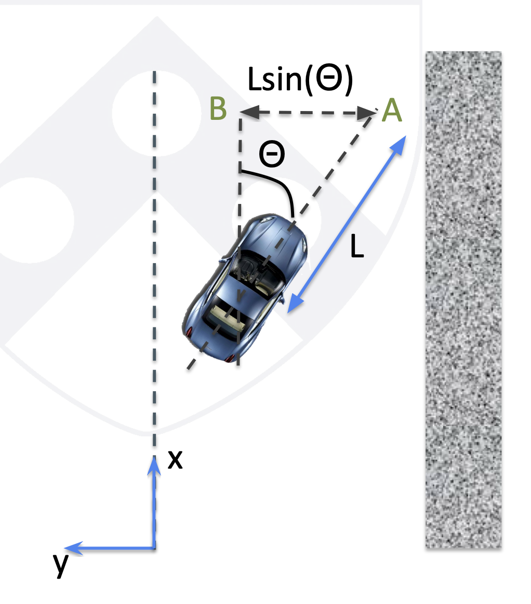
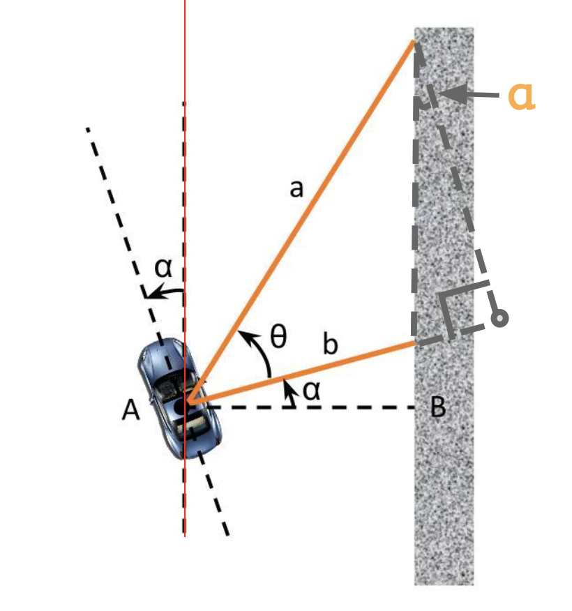

# PID for Wall Following
Your car will be traveling at a high speed and therefore will have a non-instantaneous response to whatever speed and servo control you give to it. If we simply use the current distance to the wall, we might end up turning too late, and the car may crash. Therefore, we must look to the future and project the car ahead by a certain **lookahead distance**.

Objective:  
$$
e(t) = - (y + L \sin \theta)
$$
- Close to center of corridor.
- Parallel to wall.

Proportional control:  
$$
\beta = K_p e(t)
$$
Decrease the error.

Derivative control:  
$$
\beta = K_pe(t) + K_d \frac{d}{dt}e(t)
$$
Predict future error with rate of change to dampen oscillations.

Integral control:  
$$
\beta = K_p e(t) + K_i \int_0^t e(t)dt + K_d \frac{d}{dt}e(t)
$$
Eliminate steady state error.

# Computing the Errors
To compute the objective, we need to compute the distance to the wall.

  
$$
\alpha = \arctan(\frac{a \cos\theta - b}{a \sin\theta})
$$
$$
\text{AB} = b \cos\alpha
$$