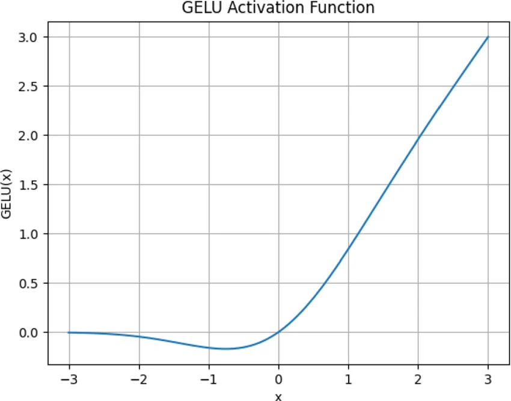

# Sigmoid
$$
\sigma (x) = \frac{1}{1 + e^{-x}}
$$

# ReLU
Rectified Linear Unit.
$$
\mathrm{ReLU(x)} = \max(0, x)
$$

# GeLU
Gaussian Error Linear Unit.
$$
\mathrm{GeLU}(x) = x \Phi(x)
$$
where $\Phi(x)$ is the **standard normal cumulative distribution function**.

The standard normal cumulative distribution function is the probability that a standard normal random variable $Z$ is at most $x$:
$$
\Phi(x) = P(Z \leq x) = \int_{-\infty}^x \frac{1}{\sqrt{2\pi}} e^{-t^2/2} dt
$$

