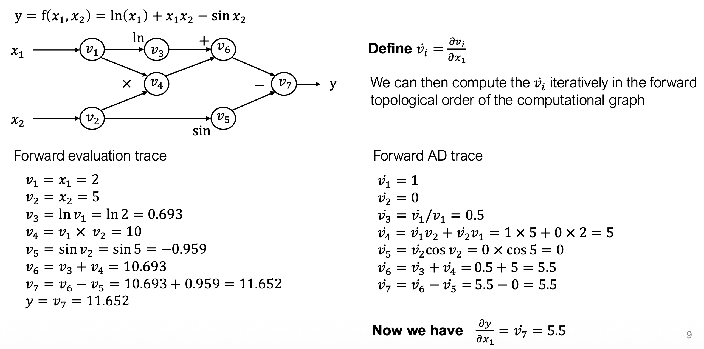
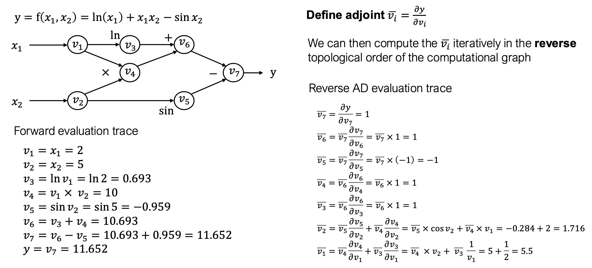
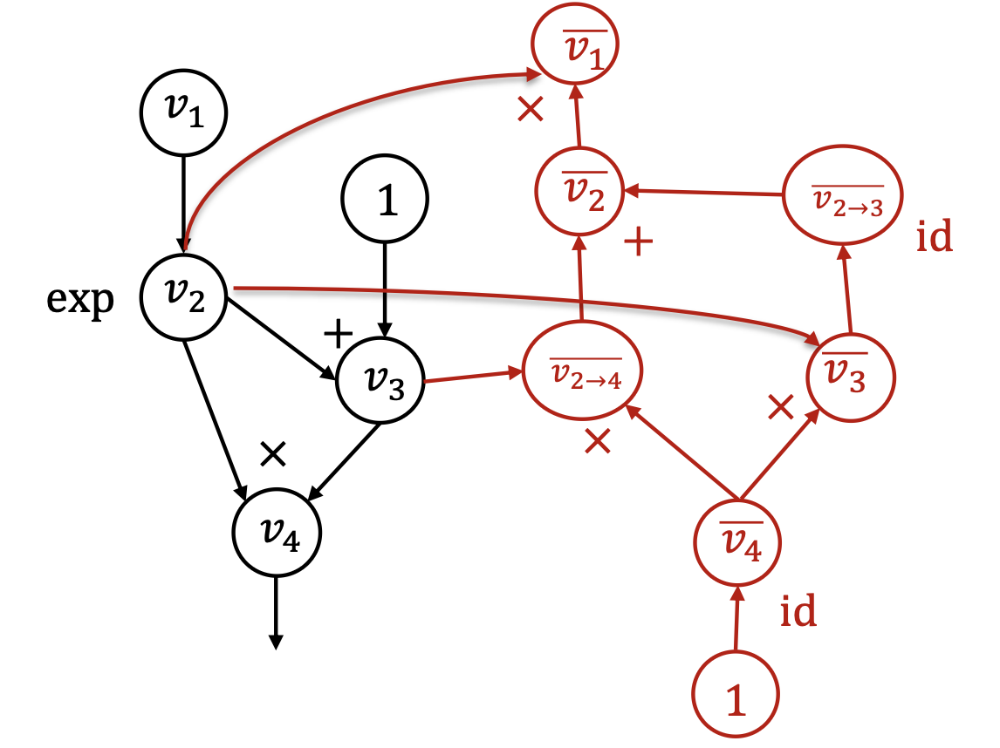

# Numerical Differentiation
Gradient by definition:
$$
\frac{\partial f(\theta)}{\partial \theta_i} = \lim_{\epsilon \rightarrow 0} \frac{f(\theta + \epsilon e_i) - f(\theta)}{\epsilon}
$$

According to Taylor's expansion:
$$
f(\theta + \delta) = f(\theta) + f'(\theta) \delta + \frac{1}{2} f''(\theta) \delta^2 + \cdots
$$
This is a more numerically accurate way to approximate the gradient:
$$
\frac{\partial f(\theta)}{\partial \theta_i} = \frac{f(\theta + \epsilon e_i) - f(\theta - \epsilon e_i)}{2 \epsilon} + o(\epsilon^2)
$$

Disadvantages:
- Truncation error: a finite $h$ approximates the gradient.
- Rounding error: numerical errors when $h$ is small.
- Inefficiency: requires 2 forward passes.
## Numerical Gradient Checking
However, numerical differentiation is a powerful tool to check an implement of an automatic differentiation algorithm.

Pick $\delta$ from unit ball, check the following invariance:
$$
\delta^T \nabla_\theta f(\theta) = \frac{f(\theta + \epsilon \delta) - f(\theta - \epsilon \delta)}{2 \epsilon} + o(\epsilon^2)
$$

# Symbolic Differentiation
Wasted computations.

# Forward Mode AD

Limitation: 
For $f: \mathbb R^n \rightarrow \mathbb R^k$, we need $n$ forward mode AD passes to get gradient with respect to each input. In deep learning, in most cases, $n > k = 1$.

# Reverse Mode AD
## Backprop

## Reverse Mode AD by Extending Computational Graph
In a deep learning framework, automatic differentiation is often implemented with **reverse mode AD by extending computational graph**.

The framework extends the original computational graph to include the operations and values that happened during the back propagation. The result is a larger computational graph that includes the path by which the gradient is computed.

This allows the framework to compute the **gradient of gradients** by doing another reverse mode AD on the extended computational graph.

