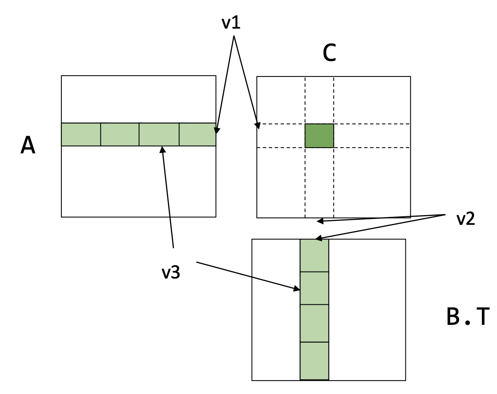
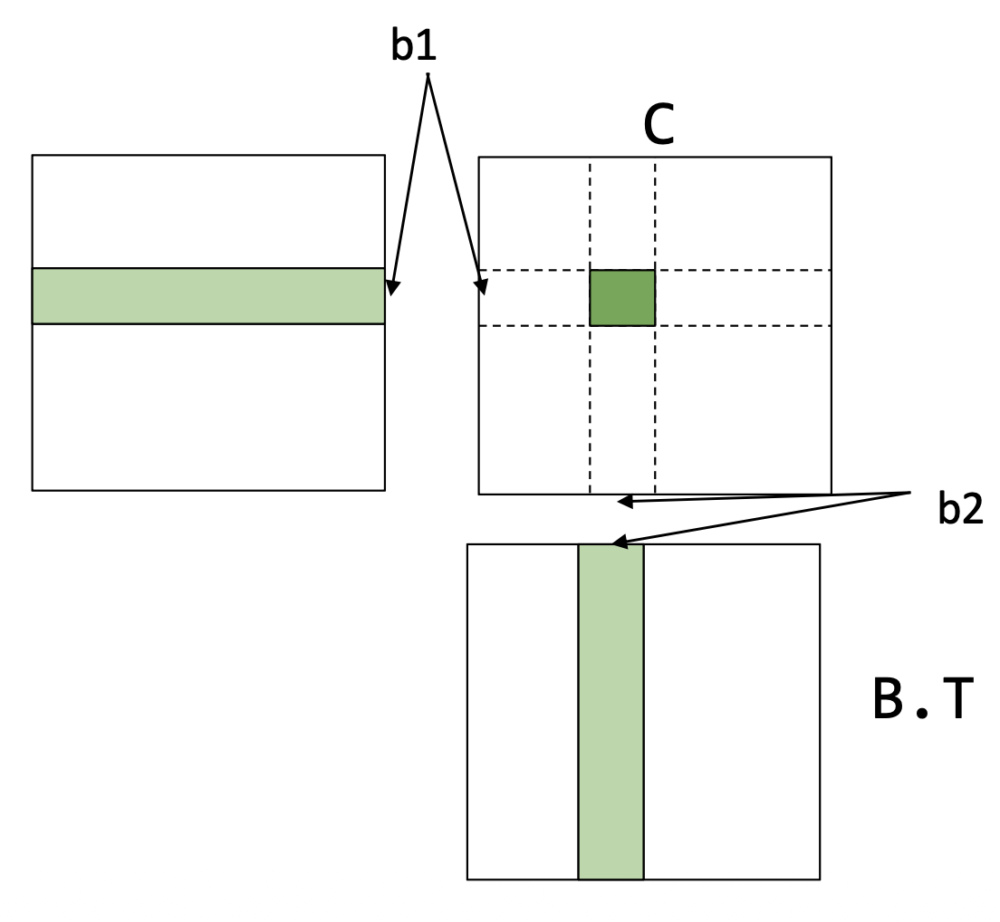

Methods:
- Vectorization.
- Data layout.
- Parallelization.

# Memory Alignment
When a `float4` vector is allocated in memory, it typically has a 16 byte (or more) memory alignment.

**The memory alignment lets the processor potentially load or store the entire vector using one memory operation.**

For example, CUDA GPUs usually service global memory using aligned 32 byte blocks. The 16 byte memory alignment ensures that the entire vector can be loaded or stored with only one block access.

# Data Layout
Row major:
```
A[i, j] = A.data[i * A.shape[1] + j]
```
- NumPy

Column major:
```
A[i, j] = A.data[j * A.shape[0] + i]
```
- Fortran
- cuBLAS

**Strides format**:
```
A[i, j] = A.data[i * A.stride[0] + j * A.stride[1]]
```

**Advantage of strides format: can perform transpose/broadcast without copying.**
- Transpose: swap the strides.
- Broadcast: insert a new 0 stride.

**Disadvantage of strides format: memory access becomes non-continuous.**
- Many linear algebra operations may require compacting the array first.

# Matrix Multiplication
Vanilla matrix multiplication.
```
dram float A[n][n], B[n][n], C[n][n];

for (int i = 0; i < n; ++i) {
	for (int j = 0; j < n; ++j) {
		register float c = 0;
		for (int k = 0; k < n; ++k) {
			register float a = A[i][k];
			register float b = B[j][k];
			c += a * b;
		}
		C[i][j] = c;
	}
}
```

Architecture aware analysis:
- Memory load cost: $2 \times n^3$ numbers loaded dram -> register.
- Register cost: 3 registers needed.

**Register level tiled matrix multiplication.**


```
dram float A[n/v1][n/v3][v1][v3];
dram float B[n/v2][n/v3][v2][v3];
dram float C[n/v1][n/v2][v1][v2];

for (int i = 0; i < n/v1; ++i) {
	for (int j = 0; j < n/v2; ++j) {
		register float c[v1][v2] = 0;
		for (int k = 0; k < n/v3; ++k) {
			register float a[v1][v3] = A[i][k];
			register float b[v2][v3] = B[j][k];
			c += dot(a, b.T);
		}
		C[i][j] = c;
	}
}
```

Architecture aware analysis:
- Memory load cost: $n^3/v_2 + n^3/v_1$ numbers loaded dram -> register.
- Register cost: $v_1v_2 + v_1v_3 + v_2v_3$ registers needed.

How to choose $v_1$, $v_2$ and $v_3$?
- Number of registers needed need to be smaller than number of registers the device has.
- Memory load cost does not depend on $v_3$ -> want $v_1$ and $v_2$ to be as large as possible -> $v_3 = 1$.

**Key insight: tiling allows data loaded into the register to be reused multiple times before being unloaded.**
- a get reused $v_2$ times: $n^3 / v_2$ numbers loaded dram -> register.
- b get reused $v_1$ times: $n^3/v_1$ numbers loaded dram -> register.

**Cache level tiled matrix multiplication.**


```
dram float A[n/b1][b1][n];
dram float B[n/b2][b2][n];
dram float C[n/b1][n/b2][b1][b2];

for (int i = 0; i < n/b1; ++i) {
	l1cache float a[b1][n] = A[i];
	for (int j = 0; j < n/b2; ++j) {
		l1cache b[b2][n] = B[j];
		C[i][j] = register_tiled_dot(a, b.T);
	}
}
```

Architecture aware analysis:
- Memory load cost: $n^2 + n^3/b_1$ numbers loaded dram -> l1 cache.
- L1 cache cost: $b_1 \times n + b_2 \times n$ cache needed.

How to choose $b_1$ and $b_2$?
- To conduct register aware tiled matrix multiplication, we need $v_1 | b_1$ and $v_2 | b_2$ -> $b_2 = v_2$.

**Putting it together.**
```
dram float A[n/b1][b1/v1][n][v1];
dram float B[n/b2][b2/v2][n][v2];

for (int i = 0; i < n/b1; ++i) {
	l1cache float a[b1/v1][n][v1] = A[i];
	for (int j = 0; j < n/b2; ++j) {
		l1cache b[b2/v2][n][v2] = B[j];
		for (int x = 0; x < b1/v1; ++x)
			for (int y = 0; y < b2/v2; ++y) {
				register float c[v1][v2] = 0;
				for (int k = 0; k < n; ++k) {
					register float ar[v1] = a[x][k][:];
					register float br[v2] = b[y][k][:];
					C += dot(ar, br.T)
				}
			}
	}
}
```

