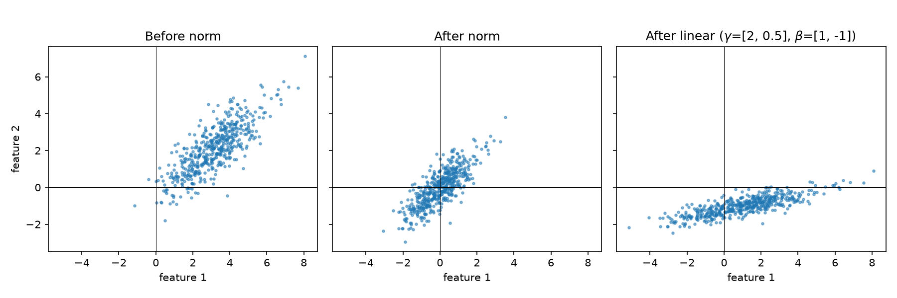
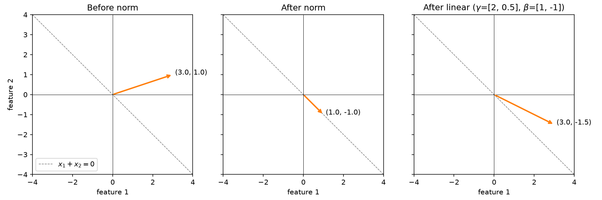
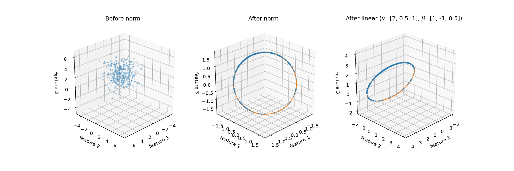

Normalization keeps numbers at a stable scale.

Its effects can be modeled by the neural network itself. But it makes training much easier, faster and more stable.

# Batch Normalization
Batch normalization **normalizes each feature independently** across all activations/tokens in the same batch.

For all features $x_{ij}$, where i identifies the activation/token, and j identifies the feature:
$$
\mu_j = \frac{1}{m} \sum_{i=1}^m x_{ij}
$$
$$
\sigma_j^2 = \frac{1}{m} \sum_{i=1}^m (x_{ij} - \mu_j)
$$
$$
y_{ij} = \gamma_j \frac{x_{ij} - \mu_j}{\sqrt{\sigma_j^2 + \epsilon}} + \beta_j
$$

Permanently forcing every feature to have zero mean and unit variance could restrict the network, therefore, a learnable weight $\gamma_i$ and bias $\beta_i$ are introduced to let the network choose a useful scale and center while retaining the optimization benefits of normalization.

**The result is equivalent to adjusting the center and scale of each feature independently.**

# Layer Normaliztion
Layer normalization **normalizes each activation/token independently** across its features.

For all features $x_{ij}$, where i identifies the activation/token, and j identifies the feature:
$$
\mu_i = \frac{1}{d} \sum_{j=1}^d x_j
$$
$$
\sigma_i^2 = \frac{1}{d} \sum_{j=1}^d (x_j - \mu_i)^2
$$
$$
y_{ij} = \gamma_j \frac{x_{ij} - \mu_i}{\sqrt{\sigma_o^2 + \epsilon}} + \beta_j
$$

Note that the learned weight $\gamma_j$ and bais $\beta_j$ are still **per feature**.

Note that in the 2d example, the vector after layer norm is either $[0, 0]$, $[1, -1]$ or $[-1, 1]$. Some information may be lost due to feature correlation in layer normalization.

If $d$ is the size of the input vector, $k$ is the dimension of the input set $S$, $k \leq d$:
$$
\text{dim} \ {\text{LN}(S)} \leq \min(k, d-2)
$$